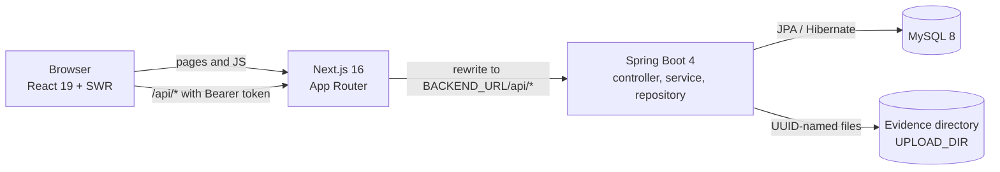
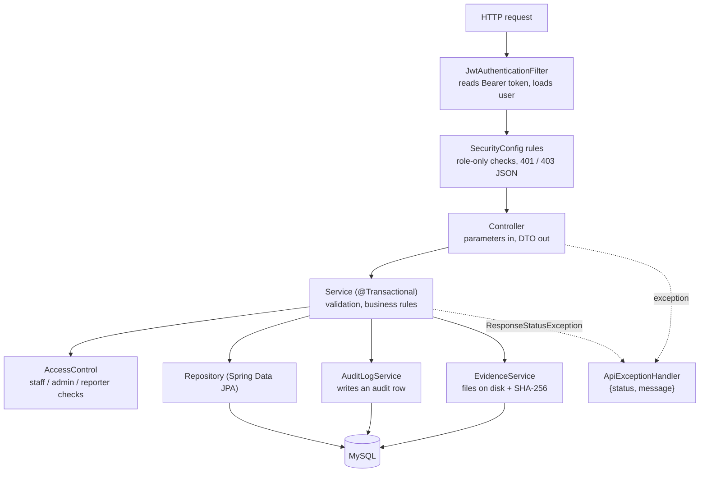
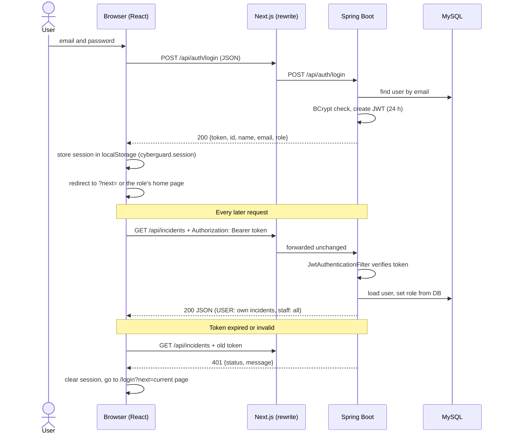
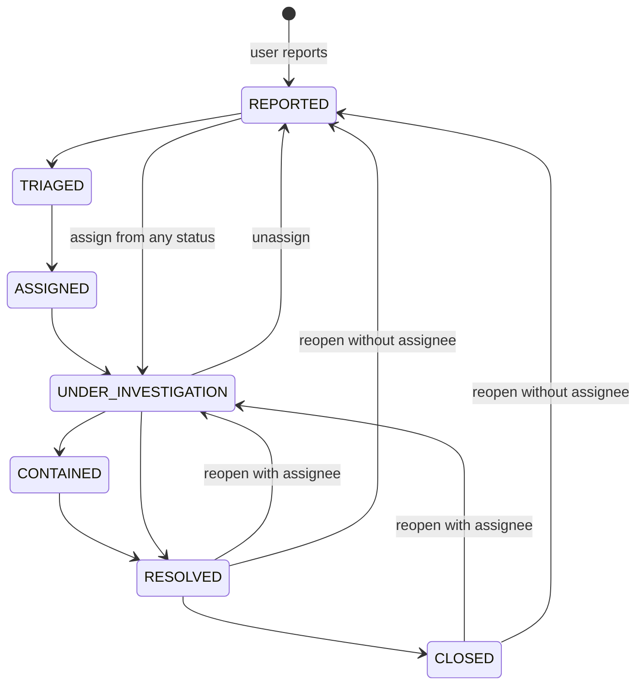

# Architecture

This document describes how CyberGuard is put together and why. It only describes what the code does today; things that are missing are listed under [Known limitations](#known-limitations-and-future-work).

Related documents: [API reference](api.md), [database](database.md), [deployment](deployment.md), [testing](testing.md), [user guide](user-guide.md).

## 1. System overview

CyberGuard has three runtime parts: a Next.js frontend, a Spring Boot REST API and a MySQL database. The browser only ever talks to the Next.js origin. Next.js forwards every request whose path starts with `/api` to the Spring Boot service (a rewrite configured in `frontend/next.config.ts`), so the browser never makes a cross-origin call.

```
+---------+   /login, /dashboard, ...    +-----------------+  rewrite /api/*   +-------------------+        +-------+
| Browser | ---------------------------> | Next.js 16      | ----------------> | Spring Boot 4     | -----> | MySQL |
| (React) | <--------------------------- | (App Router)    | <---------------- | REST API, JWT     | <----- |   8   |
+---------+   HTML/JS, JSON via /api     +-----------------+   BACKEND_URL     +---------+---------+        +-------+
                                                                                        |
                                                                                        v
                                                                              evidence files on disk
                                                                              (UPLOAD_DIR)
```



Key points:

- Pages are rendered by Next.js, but all data comes from the API in the browser (client components with SWR). There are no server-side data fetches and no Next.js route handlers.
- `BACKEND_URL` is read by Next.js on the server when it builds the rewrite. It is not exposed to the browser bundle.
- The backend is stateless: no HTTP session, authentication is a JWT in the `Authorization` header.
- Evidence files live on the backend's local disk; only their metadata is in MySQL.

## 2. Backend

Package root: `backend/src/main/java/com/cyberguard/cyberincident`.

| Package | Contents |
|---|---|
| `controller` | `AuthController`, `IncidentController`, `InvestigationNoteController`, `EvidenceController`, `AuditLogController`, `UserController`. Map HTTP to service calls and entities to DTOs. |
| `service` | `IncidentService`, `InvestigationNoteService`, `EvidenceService`, `AuditLogService`, `UserService`, `JwtService`, `AccessControl`. Business rules and transactions. |
| `repository` | Spring Data JPA interfaces (`IncidentRepository`, `UserRepository`, and so on). |
| `model` | JPA entities and enums. See [database.md](database.md). |
| `dto` | Response objects (`IncidentResponseDto`, `LoginResponse`, ...). They are the source of truth for field names in the JSON. |
| `config` | `SecurityConfig`, `JwtAuthenticationFilter`, `DemoDataSeeder` (profile `e2e` only). |
| `exception` | `ApiExceptionHandler`. |

### 2.1 Layering



Controllers stay thin. Services do the work and throw `ResponseStatusException` for errors (400, 403, 404, 409). The request/response DTOs are small: requests are plain `@RequestParam` values (form or query string) except login, which is a JSON `LoginRequest`.

### 2.2 Authentication and authorization on the server

Authorization is checked in two places, on purpose:

1. **`SecurityConfig`** handles rules that depend only on the role, for example "only ADMIN may call `PUT /api/incidents/*/assign`". It also turns failures into JSON: `401 Authentication required` for a missing or invalid token and `403 Access denied` for a wrong role.
2. **`AccessControl`** (used by the services) handles rules that depend on the data: `requireStaff`, `requireAdmin`, and `requireStaffOrReporter(user, incident)`, which lets a USER touch an incident only if they reported it.

`JwtAuthenticationFilter` runs before the standard login filter. For every request outside `/api/auth/` it:

1. reads `Authorization: Bearer <token>`,
2. verifies the signature and expiry with `JwtService` (HMAC key from `JWT_SECRET`, token lifetime 24 hours),
3. loads the user by the email in the token,
4. sets the authority from the role stored in the database (tokens carry no role) and keeps the loaded user in the authentication, so `AccessControl.currentUser` does not query it again.

If the token is missing, malformed or expired, the filter leaves the request unauthenticated and the security rules answer 401. Because the role is read from the database on every request, a role change by an admin takes effect on the server immediately.

Passwords are stored with BCrypt. Sessions are disabled (`STATELESS`) and CSRF protection is switched off, which is the usual setup for a header-token API (there is no cookie to forge).

### 2.3 Errors

`ApiExceptionHandler` extends Spring's `ResponseEntityExceptionHandler` and replaces the body of every error with `{ "status": <code>, "message": "<text>" }`. Unexpected exceptions are logged and returned as `500 Unexpected server error` without details.

### 2.4 Audit trail

`AuditLogService.log(user, incident, action, details)` is called by the services in the same transaction as the change. Actions written today: `INCIDENT_CREATED`, `STATUS_CHANGED`, `INCIDENT_ASSIGNED`, `INCIDENT_UNASSIGNED`, `NOTE_ADDED`, `EVIDENCE_UPLOADED`, `INCIDENT_DELETED`. When an incident is deleted, its audit rows are deleted with it and a single `INCIDENT_DELETED` row (with no incident reference) is written so the deletion itself stays on record. Details are cut to 255 characters.

### 2.5 Evidence storage

`EvidenceService` writes each upload to `UPLOAD_DIR` (default `uploads/evidence`) under a random UUID file name. Only a short alphanumeric extension from the original name is kept. The original file name, content type, size and SHA-256 hash are stored in the `evidence` table. Download streams the file with `Content-Disposition: attachment`. Maximum upload size is 10 MB (`spring.servlet.multipart`). Deleting an incident deletes its evidence rows and files.

## 3. Frontend

Source root: `frontend/src`. Next.js 16 (App Router), React 19, TypeScript, Tailwind CSS 4.

```
src/
  app/            routes (file-based), root layout, providers, globals.css (design tokens)
  components/     ui (UI kit), layout (shell), auth, incidents, portal, dashboard, admin
  hooks/          SWR data hooks, session hook
  lib/api/        the only code that calls fetch (client.ts) plus one file per resource
  lib/auth/       access.ts (route table), permissions.ts (can), session.ts (token storage)
  lib/domain/     pure functions: labels, SLA, filters, statistics
  types/          api.ts (DTO shapes) and domain.ts (what the UI uses)
```

### 3.1 Routes

Route groups: `(public)` for sign-in pages and `(app)` for everything behind the shell. `app/(app)/layout.tsx` wraps all signed-in pages in `AuthGuard` and `AppShell`.

| Path | Page | Allowed roles |
|---|---|---|
| `/` | Redirects to `/login` or to the role's home page | any |
| `/login`, `/register` | Sign in, create account (redirects away if already signed in) | public |
| `/dashboard` | Filterable charts, KPIs, incident table, recent activity | ANALYST, ADMIN |
| `/incidents` | Searchable incident list (15 per page) | ANALYST, ADMIN |
| `/incidents/[id]` | Incident detail: status, notes, evidence, timeline, assignment | ANALYST, ADMIN |
| `/team` | Staff cards with workload, per-person incident dialog | ANALYST, ADMIN |
| `/admin/command-center` | SLA breaches, workload, 14-day trend, team performance | ADMIN |
| `/admin/triage` | Kanban board with drag and drop | ADMIN |
| `/admin/users` | User list and role changes | ADMIN |
| `/portal` | Reporter overview | USER |
| `/portal/report` | Four-step report wizard | USER |
| `/portal/cases`, `/portal/cases/[id]` | Reporter's own cases and case detail | USER |
| `/portal/safety` | Safety tips per incident type | USER |

Home pages after sign-in: USER `/portal`, ANALYST `/dashboard`, ADMIN `/admin/command-center`.

The same table (`lib/auth/access.ts`, `ROUTES`) drives three things: the sidebar and mobile drawer (`navFor(role)`), the `AuthGuard` redirect (`canAccess`), and the post-login `?next=` redirect (`safeNext`, which only accepts local paths the role may open). A path is governed by its longest matching prefix; a signed-in user who opens a page for another role is sent to their own home page.

### 3.2 API layer

`lib/api/client.ts` is the only place that calls `fetch`. Everything else goes through `request()` or `requestBlob()`:

- all URLs start with `/api` on the current origin (see the rewrite above),
- the Bearer token is added from the session unless `auth: false` (login and register),
- bodies are sent as JSON (login), `application/x-www-form-urlencoded` in the body (everything else that carries parameters, so passwords never appear in a URL) or `multipart/form-data` (evidence),
- failures become an `ApiError` with a status and a readable message; a network failure is status `0`,
- a 401 on an authenticated request calls `onUnauthorized` (see [section 4](#4-authentication-flow)).

`lib/api/mappers.ts` converts backend DTOs to UI types. Its main job is timestamps: the backend sends `LocalDateTime` without an offset, in UTC, so the mapper appends `Z` before creating a `Date` (it also accepts the array form `[y, m, d, h, mi, s]`).

### 3.3 Data hooks and SWR

Each resource has a small hook in `hooks/` built on SWR: `useIncidents`, `useIncident`, `useNotes`, `useEvidence`, `useAuditLog`, `useRecentActivity`, `useStaff`, `useUsers`.

- `useAuthedKey` returns `null` (so SWR does nothing) until a user is signed in, and also when the user's role is not allowed to call the endpoint. This avoids sending requests that are certain to fail with 401 or 403.
- `useIncidents` polls every 20 seconds, `useRecentActivity` every 30 seconds. `useNewIncidentAlerts` compares successive polls to show a toast for each new incident reported by someone else and a banner for a new critical one (staff only).
- Global SWR options (`app/providers.tsx`): `shouldRetryOnError: false`, `revalidateOnFocus: true`.
- The API has no "get one incident" endpoint, so `useIncident` picks the incident out of the cached list returned by `GET /api/incidents`.
- Writes patch the shared list. The triage board applies the change optimistically and rolls back if the server rejects it (`rollbackOnError`); other writes wait for the server answer and then patch the list.
- Signing out clears the whole SWR cache.

### 3.4 Authorization in the UI

`lib/auth/permissions.ts` exports `can(user, action, incident?)`. Components never compare roles themselves; they ask `can`. The rules mirror the backend:

| Action | Rule in `can()` |
|---|---|
| `incident:create` | any signed-in user |
| `incident:changeStatus`, `note:add`, `audit:readRecent` | ANALYST or ADMIN |
| `incident:assign`, `incident:delete`, `users:manage` | ADMIN |
| `note:read`, `evidence:read`, `evidence:upload`, `audit:readIncident` | ANALYST or ADMIN, or the reporter of that incident |

This only decides what to show. The server enforces the same rules and is the real boundary.

### 3.5 UI kit, theme and charts

- `components/ui/` holds the shared pieces: `Button`, `Card`, `Badge`, `SeverityBadge`, `StatusBadge`, `KpiCard`, `DataTable` (sortable, paginated), `Dialog`, `Field`/`Input`/`Select`/`Textarea`, `Chips`, `RiskMeter`, `StatusStepper`, `Skeleton`, `EmptyState`, `ErrorState`, `Toaster`, `ThemeToggle`, `Avatar`, `Progress`.
- Icons come from `@mui/icons-material`, imported one icon per file. No MUI components or MUI theme are used. `AppRouterCacheProvider` with `enableCssLayer` and the layer order `theme, base, mui, components, utilities` in `globals.css` keep Tailwind utilities above MUI's injected icon styles.
- Design tokens are CSS variables in `globals.css` (`--surface`, `--panel`, `--border`, `--fg`, `--muted`, `--accent`, severity colours, chart series colours), mapped to Tailwind colours with `@theme inline`. The `.dark` class (set by `next-themes`) overrides them. Dark is the default theme and the system preference is ignored (`enableSystem={false}`); the choice is remembered by `next-themes`.
- Severity is always shown as a label plus an icon or text, never colour alone. Focus rings use `:focus-visible`; animations are shortened under `prefers-reduced-motion`.
- Charts use Recharts: stacked bars per day by severity and bar charts by status, type and staff workload (dashboard, command center), and a line chart for the 14-day trend (command center). Each chart has a tooltip and an `aria-label` summary; charts with several series have a legend. Clicking a bar on the dashboard applies it as a filter.

## 4. Authentication flow



Details that are easy to miss:

- On page load `lib/auth/session.ts` reads the stored session and discards it if the `exp` claim of the token is in the past, so an expired token does not cause a flash of protected content.
- The session is exposed to React with `useSyncExternalStore`, with a server snapshot of `undefined`. While the status is `loading`, `AuthGuard` shows a loading message, which avoids a hydration mismatch.
- A `storage` event listener keeps tabs in sync: signing out in one tab signs out the others.
- A 401 from `/auth/login` or `/auth/register` is shown as a form error and does not trigger the expiry redirect.
- The stored `role` is the one from login time. If an admin changes your role, the server uses the new role immediately, but the navigation in your open session only updates after you sign in again.

## 5. Authorization matrix

What each role can do, as enforced by the backend (`SecurityConfig` plus `AccessControl`). "Own" means incidents the user reported.

| Action | USER | ANALYST | ADMIN |
|---|---|---|---|
| Register, sign in | yes | yes | yes |
| Report an incident | yes | yes | yes |
| List incidents (`GET /api/incidents`) | own only | all | all |
| Change status | no | yes | yes |
| Assign / unassign | no | no | yes |
| Delete incident | no | no | yes |
| Read notes | own | all | all |
| Add note | no | yes | yes |
| Read evidence list, download file | own | all | all |
| Upload evidence | own | all | all |
| Read an incident's audit trail | own | all | all |
| Read recent audit log (all incidents) | no | yes | yes |
| List staff (`GET /api/users/staff`) | no | yes | yes |
| List all users, change a role | no | no | yes (not their own role) |

The reporter UI is deliberately limited as well: users have their own portal and cannot open the staff pages. The automated tests that cover these rules are listed in [testing.md](testing.md).

## 6. Incident lifecycle

An incident has one of seven statuses. The backend accepts any status as the new value for `PUT /api/incidents/{id}/status`; it does not enforce an order. The order below is the intended workflow shown in the UI (the status steps and quick-action buttons).



Diagram notes: the straight-line path is the intended workflow. "Assign" is shown from REPORTED, but it applies to any status. "Unassign" only changes the status when it is `UNDER_INVESTIGATION`; in other statuses it clears the assignee and leaves the status alone.

Behaviour worth knowing:

- Staff can jump to any status by clicking a step, or use quick actions: Investigate (from Reported, Triaged or Assigned), Contain, Resolve, Close, and Reopen for Resolved or Closed incidents.
- **Assign** (`PUT .../assign`, admin only) always sets the status to `UNDER_INVESTIGATION`. The `TRIAGED` and `ASSIGNED` statuses are only ever set by hand. Assigning an incident that is already resolved or closed also moves it back to `UNDER_INVESTIGATION`; the triage board hides the assign action for solved incidents, the assignment box on the detail page does not.
- **Unassign** clears the assignee and returns an `UNDER_INVESTIGATION` incident to `REPORTED`.
- The only assignable people are ANALYST and ADMIN accounts.
- "Open" means any status except `RESOLVED` and `CLOSED`. The UI groups statuses as Reported (REPORTED), Assigned (ASSIGNED), In progress (TRIAGED, UNDER_INVESTIGATION, CONTAINED) and Solved (RESOLVED, CLOSED).
- The progress percentage shown in tables is derived from the status in the frontend (0, 15, 25, 50, 75, 95, 100); the backend stores no progress value.
- The risk score (0-100) is entered by the reporter with a slider, pre-filled from the chosen severity. It is not calculated by the system.

## 7. SLA policy

The SLA is a fixed policy in `lib/domain/incident.ts`. The time allowed from report to resolution depends on severity:

| Severity | Allowed time |
|---|---|
| Critical | 4 hours |
| High | 24 hours |
| Medium | 72 hours (3 days) |
| Low | 168 hours (7 days) |

The deadline is `reportedAt + allowed time`. An incident is **breached** when it is still open (not Resolved or Closed) and the current time is past the deadline. Notes:

- It is computed in the browser from the incident list; the backend does not store or evaluate SLAs, and nothing is sent when a breach happens.
- The clock does not pause for any status and does not restart on reopen; it always counts from the original report time.
- The current time refreshes every minute (`useNow`), so timers stay current without a reload.
- A resolved incident is never counted as breached afterwards, whatever time it was resolved at; the backend does not record a resolution time, so "resolved late" cannot be reported.
- The command center also flags a staff member as "Overloaded" at 4 or more open incidents (`OVERLOADED_OPEN`) and "Idle" at 0.

## 8. Key design decisions and trade-offs

**Same-origin `/api` rewrite instead of CORS.** The browser calls `/api/...` on the frontend origin and Next.js forwards it. Benefits: no CORS setup for normal use, one place (`BACKEND_URL`) to change the backend address, and the backend URL is not in the client bundle. Costs: every API call has an extra network hop through Next.js, and the frontend host must be able to reach the backend. The backend still has a CORS configuration (`CORS_ALLOWED_ORIGINS`) so it can also be called directly from a browser origin if needed.

**JWT in `localStorage`.** The token is sent in an `Authorization` header, which keeps the backend stateless and needs no CSRF protection. The trade-off is that any script running on the page can read `localStorage`, so a cross-site scripting (XSS) bug would leak the token. Mitigations in place: React escapes rendered text and the code base does not use `dangerouslySetInnerHTML`; `next.config.ts` sets `X-Content-Type-Options`, `Referrer-Policy` and `X-Frame-Options`; tokens expire after 24 hours. There is no Content-Security-Policy header yet. The usual alternative, an httpOnly `SameSite` cookie, protects the token from scripts but brings CSRF concerns and was left out to keep the project small (see future work).

**Client-side aggregation for dashboards.** There is no backend endpoint for statistics: the UI needs per-day, per-type, per-status and per-staff figures with filters. Because the frontend already holds the full incident list (needed for the tables), `lib/domain/stats.ts` computes everything in the browser. This keeps the backend simple and makes filters instant, and the statistics are plain, easily unit-testable functions. It does not scale to very large incident counts, because every incident is downloaded and every chart is recomputed on the client.

**SWR for server state.** SWR gives caching, de-duplication, revalidation on focus, polling and optimistic updates with very little code, and a shared cache means the list, detail page, triage board and dashboard see the same data. Polling is simpler than WebSockets and sufficient for a few users; the cost is up to 20 seconds of delay for new incidents and repeated requests.

**Authorization on the server, mirrored in the UI.** The route table and `can()` exist so the UI does not show actions that would fail, but they are not a security boundary. Every rule is enforced again by the API.

**One list endpoint, no per-id endpoint.** The detail page reads the incident from the cached list. This avoids one more endpoint but means the detail view depends on the list loading first.

**`ddl-auto=update`, no migration tool.** Hibernate creates and extends tables on start. It is convenient for a student project and means a fresh database needs no scripts; the cost is no versioned schema history (see [database.md](database.md)).

## Known limitations and future work

- **Token storage:** the JWT is in `localStorage` (see above). Moving to an httpOnly `SameSite` cookie, plus a Content-Security-Policy, is the first hardening step.
- **No refresh tokens or revocation:** a token is valid for 24 hours; signing out only removes it from the browser. There is no password reset, e-mail verification, account lockout or login rate limiting, and users cannot be deactivated or deleted.
- **Stale role in the open session:** see section 4.
- **Evidence on local disk:** files are stored on the backend host. On Render's free plan and on Railway the disk is wiped on every deploy or restart unless a persistent volume is mounted and `UPLOAD_DIR` points to it (see [deployment.md](deployment.md)). There is no virus scanning and no check of file type or content; files are served back only as attachments.
- **No notifications:** nothing is sent by e-mail or push. Staff see new incidents through polling (toast and banner) while the app is open.
- **No server-side pagination, filtering or search:** `GET /api/incidents` returns all incidents the user may see; tables paginate in the browser.
- **Status changes are not validated on the server:** any status can be set from any other, and assigning an already solved incident reopens it.
- **SLA is advisory:** computed in the browser only, not stored, not escalated, no resolution timestamp.
- **Audit log:** rows are removed with their incident; entries are not tamper-evident.
- **No schema migrations:** see [database.md](database.md).
