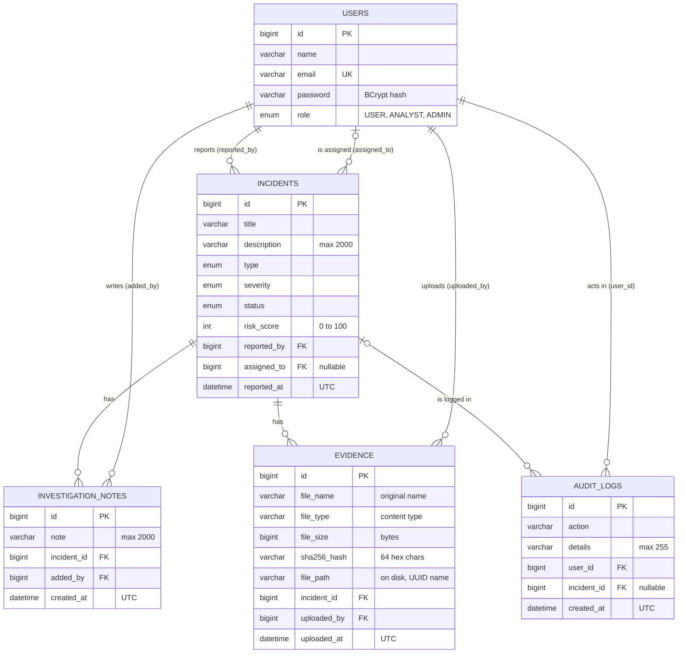

# Database

CyberGuard uses MySQL 8. The schema is generated from the JPA entities in `backend/src/main/java/com/cyberguard/cyberincident/model`; there are no SQL migration scripts. The backend tests use an in-memory H2 database in MySQL mode instead (see [testing.md](testing.md)).

The column details below match what Hibernate created in a local MySQL 8 database (`SHOW CREATE TABLE`).

## Entity relationship diagram



## Tables

All primary keys are `bigint` auto-increment (`GenerationType.IDENTITY`). All columns are `NOT NULL` unless stated.

### `users` (entity `User`)

| Column | Type | Notes |
|---|---|---|
| `id` | bigint | primary key |
| `name` | varchar(255) | 2 to 100 characters enforced by the registration service |
| `email` | varchar(255) | unique |
| `password` | varchar(255) | BCrypt hash, never returned by the API |
| `role` | enum | `USER`, `ANALYST`, `ADMIN` |

Self-registration always creates `USER`. There is no way to delete or disable a user.

### `incidents` (entity `Incident`)

| Column | Type | Notes |
|---|---|---|
| `id` | bigint | primary key |
| `title` | varchar(255) | the service allows at most 200 characters |
| `description` | varchar(2000) | |
| `type` | enum | see enums below |
| `severity` | enum | |
| `status` | enum | starts as `REPORTED` |
| `risk_score` | int | 0 to 100, validated by the service |
| `reported_by` | bigint | foreign key to `users.id` |
| `assigned_to` | bigint, nullable | foreign key to `users.id`; null while unassigned |
| `reported_at` | datetime(6) | set by the server, stored in UTC |

### `investigation_notes` (entity `InvestigationNote`)

| Column | Type | Notes |
|---|---|---|
| `id` | bigint | primary key |
| `note` | varchar(2000) | |
| `incident_id` | bigint | foreign key to `incidents.id` |
| `added_by` | bigint | foreign key to `users.id` |
| `created_at` | datetime(6) | UTC |

### `evidence` (entity `Evidence`)

Metadata only. The file itself is in the directory set by `UPLOAD_DIR`.

| Column | Type | Notes |
|---|---|---|
| `id` | bigint | primary key |
| `file_name` | varchar(255) | original name sent by the client, path parts removed |
| `file_type` | varchar(255) | content type sent by the client |
| `file_size` | bigint | bytes, at most 10 MB per file |
| `sha256_hash` | varchar(64) | hex SHA-256 of the file content |
| `file_path` | varchar(255) | path on the backend host; file name is a random UUID |
| `incident_id` | bigint | foreign key to `incidents.id` |
| `uploaded_by` | bigint | foreign key to `users.id` |
| `uploaded_at` | datetime(6) | UTC |

### `audit_logs` (entity `AuditLog`)

| Column | Type | Notes |
|---|---|---|
| `id` | bigint | primary key |
| `action` | varchar(255) | `INCIDENT_CREATED`, `STATUS_CHANGED`, `INCIDENT_ASSIGNED`, `INCIDENT_UNASSIGNED`, `NOTE_ADDED`, `EVIDENCE_UPLOADED`, `INCIDENT_DELETED` |
| `details` | varchar(255) | human-readable text, cut to 255 characters |
| `user_id` | bigint | the user who acted; foreign key to `users.id` |
| `incident_id` | bigint, nullable | foreign key to `incidents.id`; null for `INCIDENT_DELETED` so the entry survives the deletion |
| `created_at` | datetime(6) | UTC |

### Relationships and deletion

There are no `ON DELETE CASCADE` rules. Deleting an incident is done by `IncidentService.deleteIncident`, which removes the audit rows, notes and evidence (rows and files) of that incident first, then writes the `INCIDENT_DELETED` audit row, then deletes the incident. Users are never deleted.

## Enums

Stored as strings (`@Enumerated(EnumType.STRING)`). On MySQL, Hibernate created these columns as native `ENUM(...)` types.

| Enum | Values |
|---|---|
| `Role` | `USER`, `ANALYST`, `ADMIN` |
| `IncidentType` | `PHISHING`, `MALWARE`, `RANSOMWARE`, `DATA_BREACH`, `UNAUTHORIZED_ACCESS`, `DDOS`, `SOCIAL_ENGINEERING`, `OTHER` |
| `Severity` | `LOW`, `MEDIUM`, `HIGH`, `CRITICAL` |
| `IncidentStatus` | `REPORTED`, `TRIAGED`, `ASSIGNED`, `UNDER_INVESTIGATION`, `CONTAINED`, `RESOLVED`, `CLOSED` |

Because the frontend duplicates these lists (`frontend/src/types/api.ts` and `lib/domain/incident.ts`), adding a value means changing the Java enum and the frontend lists together.

## Schema management: `ddl-auto=update`

`application.properties` sets `spring.jpa.hibernate.ddl-auto=update`. On every start Hibernate compares the entities with the database and creates missing tables and columns. Consequences:

- A new database needs no setup beyond `CREATE DATABASE cyberincident;`. The first start creates all five tables.
- It only adds things. It does not drop columns, rename them or reliably change the type of an existing column, so after a larger model change on a database that already holds data you may need to alter the table by hand or start over. That includes adding a value to an enum, because the existing column is a native `ENUM`.
- There is no version history of the schema. For anything beyond a student project a migration tool such as Flyway or Liquibase would replace this.

The `e2e` profile (`application-e2e.properties`) uses `ddl-auto=create-drop` on a separate database, `cyberincident_e2e`: the schema is rebuilt on every start and removed on shutdown, and `DemoDataSeeder` inserts five test users. See [testing.md](testing.md).

## Time handling

The application sets the JVM default time zone to UTC in `CyberincidentApplication.main`, so `LocalDateTime.now()` is UTC. The JDBC URL in the examples also passes `serverTimezone=UTC`. The API sends timestamps without an offset, and the frontend adds `Z` when it parses them.

## Resetting the database

Local development database (this deletes all data):

```sql
DROP DATABASE cyberincident;
CREATE DATABASE cyberincident;
```

Then restart the backend; it recreates the tables. You will need to register again and promote an admin (see the [README](../README.md#4-first-admin-account)).

Also delete the evidence directory, because the files are no longer referenced (default `backend/uploads/evidence`, or whatever `UPLOAD_DIR` points to).

To remove only the test data without touching the main database, drop `cyberincident_e2e`; it is recreated automatically the next time the e2e profile runs.

## Useful queries

Count incidents per status:

```sql
SELECT status, COUNT(*) FROM incidents GROUP BY status;
```

Promote a user to admin:

```sql
UPDATE users SET role = 'ADMIN' WHERE email = 'you@example.com';
```

Recent audit entries:

```sql
SELECT a.created_at, a.action, a.details, u.email
FROM audit_logs a JOIN users u ON u.id = a.user_id
ORDER BY a.id DESC LIMIT 20;
```
